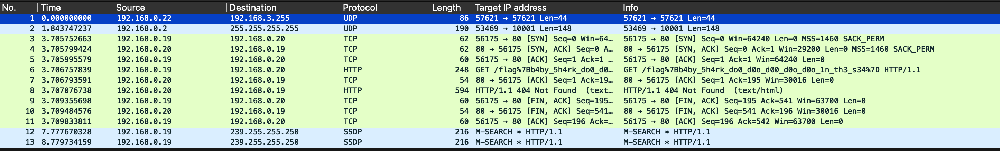

# Lost at Sea (forensics, 100 points)

> I dropped my flag in the sea. Help me find it among the sharks!

## Files:

- lost-at-sea.pcapng

## Solution:

We'll start by opening the file in Wireshark:

From here, we see that the flag is part of the GET request in packet 6. Extracting the value from Wireshark gives us

`/flag%7Bb4by_5h4rk_do0_d0o_d00_d0o_d0o_1n_th3_s34%7D`

which can be URL decoded to

`/flag{b4by_5h4rk_do0_d0o_d00_d0o_d0o_1n_th3_s34}`
