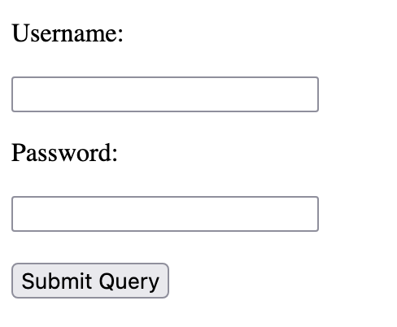
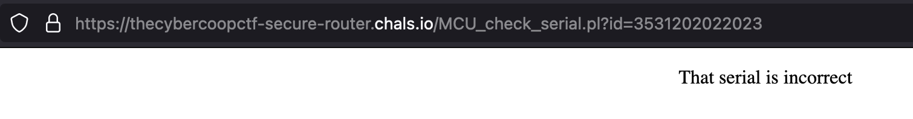
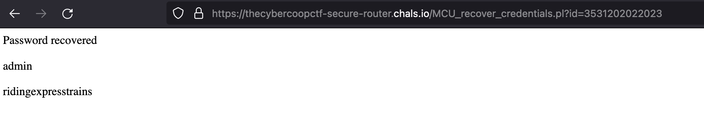
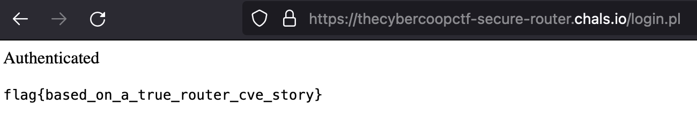

# secure router (forensics, 300 points)

> My friend bought this router. I want to hack into it so bad.
>
> The firmware for the router is online. There's gotta be bugs in it...

## Files:

- https://thecybercoopctf-secure-router.chals.io/
- secure_router.bin.tar.gz

## Solution:

Let's first take a look at the website:



Hmm... not much. Let's look at the tar file next.

When we extract the tar file, we find a SquashFS file system:

```
❯ file secure_router.bin
secure_router.bin: Squashfs filesystem, little endian, version 4.0, lzo compressed, 406945645 bytes, 33034 inodes, blocksize: 131072 bytes, created: Fri Feb  3 06:36:27 2017
```

We can extract this (ex. using sasquatch) to a file system:

```
❯ ls --tree -L 1
.
├── bin
├── boot
├── dev
├── etc
├── home
├── lib
├── lost+found
├── media
├── mnt
├── opt
├── proc
├── root
├── run
├── sbin
├── srv
├── sys
├── tmp
├── usr
└── var
```

After poking around for a bit, we find a few interesting files under `/var/www`:

`/var/www/index.perl`:
```perl
#!/usr/bin/perl

print "Content-type:text/html\r\n\r\n";

print "<html>";
print "<head>";
print "<title>Secure Router</title>";
print "</head>";
print "<body>";
print "<form method='POST' action='login.pl'>";
print "<p>Username:</p>";
print "<input type='text' name='username'>";
print "<p>Password:</p>";
print "<input type='password' name='password'>";
print "<br>";
print "<br>";
print "<input type='submit'>";
print "</form>";
print "</body>";
print "</html>";

1;
```

We've found our server! Let's look at the other files:

```
❯ ls var/www
index.pl  login.pl  MCU_check_serial.pl  MCU_recover_credentials.pl  MCU_serial_forgot_password.pl
```

`/var/www/MCU_recover_credentials.pl`

```perl
#!/usr/bin/perl

use POSIX qw(strftime);

local ($buffer, @pairs, $pair, $name, $value, %FORM);
# Read in text
$ENV{'REQUEST_METHOD'} =~ tr/a-z/A-Z/;

if ($ENV{'REQUEST_METHOD'} eq "GET") {
   $buffer = $ENV{'QUERY_STRING'};
    # Split information into name/value pairs
    @pairs = split(/&/, $buffer);

    foreach $pair (@pairs) {
       ($name, $value) = split(/=/, $pair);
       $value =~ tr/+/ /;
       $value =~ s/%(..)/pack("C", hex($1))/eg;
       $FORM{$name} = $value;
    }
}


if ($ENV{'REQUEST_METHOD'} eq "POST") {
   $buffer = $ENV{'QUERY_STRING'};
    # Split information into name/value pairs
    @pairs = split(/&/, $buffer);

    foreach $pair (@pairs) {
       ($name, $value) = split(/=/, $pair);
       $value =~ tr/+/ /;
       $value =~ s/%(..)/pack("C", hex($1))/eg;
       $FORM{$name} = $value;
    }

    read(STDIN, $buffer, $ENV{'CONTENT_LENGTH'});
    @pairs = split(/&/, $buffer);
    foreach $pair (@pairs) {
        ($name, $value) = split(/=/, $pair);
        $value =~ tr/+/ /;
        $value =~ s/%([a-fA-F0-9][a-fA-F0-9])/pack("C", hex($1))/eg;
        $FORM{$name} = $value;
    }
}

$timestamp = strftime("%j%m%H%M%Y", localtime);

open(FH,"username.txt") or &dienice("Can't open username.txt: $!");
$username = <FH>;
close(FH);

open(FH,"password.txt") or &dienice("Can't open password.txt: $!");
$password = <FH>;
close(FH);

print "Content-type:text/html\r\n\r\n";

if ($FORM{id} ne $timestamp){
    print "<html>";
    print "<head>";
    print "<title>Secure Router</title>";
    print "</head>";
    print "<body>";
    print "<center><p>Sorry, your timestamp nonce has expired</p></center>";
    print "</body>";
    print "</html>";
    exit 0;
}

print "<html>";
print "<head>";
print "<title>Secure Router</title>";
print "</head>";
print "<body>";
print "<p>Password recovered</p>";
print "<p>$username</p>";
print "<p>$password</p>";
print "</body>";
print "</html>";
```

`/var/www/MCU_serial_forgot_password.pl`

```perl
#!/usr/bin/perl

use POSIX qw(strftime);

local ($buffer, @pairs, $pair, $name, $value, %FORM);
# Read in text
$ENV{'REQUEST_METHOD'} =~ tr/a-z/A-Z/;

if ($ENV{'REQUEST_METHOD'} eq "GET") {
   $buffer = $ENV{'QUERY_STRING'};
}

# Split information into name/value pairs
@pairs = split(/&/, $buffer);

foreach $pair (@pairs) {
   ($name, $value) = split(/=/, $pair);
   $value =~ tr/+/ /;
   $value =~ s/%(..)/pack("C", hex($1))/eg;
   $FORM{$name} = $value;
}

$timestamp = strftime("%j%m%H%M%Y", localtime);

print "Content-type:text/html\r\n\r\n";
print "<html>";
print "<head>";
print "<title>Secure Router</title>";
print "</head>";
print "<body>";
print "<form method='POST' action='MCU_check_serial.pl?id=$timestamp'>";
print "<p>Router Serial Number:</p>";
print "<input type='text' name='serial'>";
print "<br>";
print "<br>";
print "<input type='submit'>";
print "</form>";
print "</body>";
print "</html>";
```

Again, our timestamp has minute precision, so we have one minute to utilize the timestamp. Additionally, we note that the recover credentials page doesn't actually check our serial...

Our attack is simple. We'll go to the recover password page, and get our timestamp. Then, we'll go directly to the recover credentials page and get our password. We'll do this at the beginning of a minute to give us the most time.






