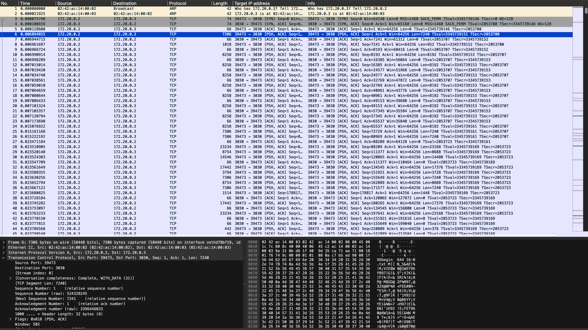

# Back In My Day (network, 300 points)

> Back in my day sharing files was a lot harder!!!

## Files:

- back-in-my-day.pcapng

## Solution:

We can again take a look at the packets in Wireshark:



Taking a look at the packets shows some sort of file transfer format being used. With a bit of searching, we find that it is `uuencode` (we can also find this out using `binwalk`!)

Let's extract everything

```
❯ tshark -r back-in-my-day.pcapng -T fields -e "data.data" > back-in-my-day.data
```

From here, we can take out newlines, convert hex to binary, and decode it. Again, `binwalk` suffices. However, I didn't realize that `binwalk` could handle this format, so I just ended up writing my own decoder.

```c
#include <stdio.h>
#include <stdlib.h>
#include <string.h>

int read_file(FILE* f) {
    // dont pwn pls :3
    int mode;
    char name[128];

    char lenchar;
    char buffer[256];
    char decoded[256];

    // begin mode name
    if (fscanf(f, "begin %d %s\n", &mode, name) == 0) return 1;

    fprintf(stderr, "found file %s\n", name);
    printf("%s: ", name);

    while (!feof(f)) {
        uint8_t data_len;

        fscanf(f, "%c%s\n", &lenchar, buffer);
        if (lenchar == 'e' && !strcmp(buffer, "nd")) {
            break;
        }
        data_len = (lenchar - 32) & 63;

        size_t j = 0;
        for (uint8_t i = 0; i < data_len; i += 3, j += 4) {
            uint32_t val = ((buffer[j] - 32) & 63) << 18 |
                           ((buffer[j+1] - 32) & 63) << 12 |
                           ((buffer[j+2] - 32) & 63) <<  6 |
                           ((buffer[j+3] - 32) & 63) <<  0;
            decoded[i] = (val >> 16) & 255;
            decoded[i+1] = (val >> 8) & 255;
            decoded[i+2] = (val >> 0) & 255;
        }
        decoded[data_len] = 0;
        printf("%s", decoded);
    }
    return 0;
}

int main() {
    FILE* f = fopen("back-in-my-dat.txt", "r");
    while (!feof(f)) read_file(f);
}
```

From here, all we have to do is run the executable, and search for `flag{`:

```
❯ ./uudecode | grep "flag{"
found file 16-0.txt
... a bunch of files ...
found file 1661-0.txt
flag{outta_the_way_ya_old_geezer}
found file 14.txt
found file 17-0.txt
```
