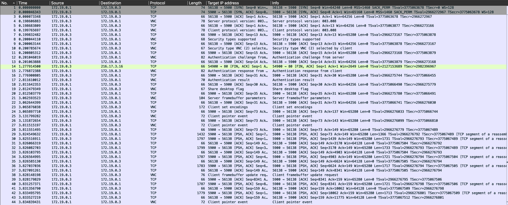
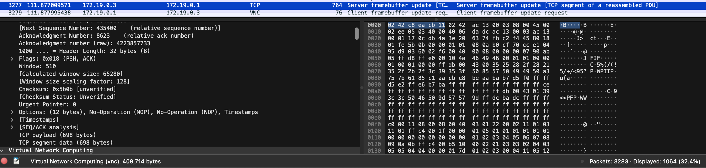

# dread pirate (network, 200 points)

> We've got an agent on the inside and we've tapped his network...

## Files:

- dpr.pcapng

## Solution:

Let's open up the PCAP in Wireshark.



Here, we see VNC traffic being captured, which suggests that we will have to look at the VNC traffic to determine the flag.

We can start by looking at VNC events. One of the packets that jumps out is packet 3277, which contains 408 kilobytes of data (sent across multiple TCP packets):



Inside, we see some JPEG image data. Let's extract this packet out into a file by copying the contents from Wireshark, and then `binwalk` it:

```
❯ binwalk bigpacket.bin

DECIMAL       HEXADECIMAL     DESCRIPTION
--------------------------------------------------------------------------------
19            0x13            JPEG image data, JFIF standard 1.01
1750          0x6D6           JPEG image data, JFIF standard 1.01
3483          0xD9B           JPEG image data, JFIF standard 1.01
5204          0x1454          JPEG image data, JFIF standard 1.01
6921          0x1B09          JPEG image data, JFIF standard 1.01
8642          0x21C2          JPEG image data, JFIF standard 1.01
10355         0x2873          JPEG image data, JFIF standard 1.01
... a lot more JPEGs
```

We can extract all these images out using `binwalk`, and if we make our way through, we eventually find the one we need:


