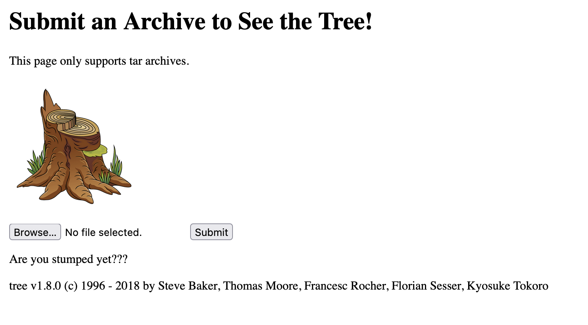

# stumped (exploitation, 500 points)

> Michael's computer science project shows the structure of tar files. It is using the tree command on the backend, and something just doesn't seem right...

## Files:

- app.py
```
❯ file app.py
app.py: Python script text executable, ASCII text
```

## Solution:

If we open up the application, we see the following:



It looks like we're able to upload arbitrary `tar.gz` files, and it will run `tzr -xzf` followed by `tree`.

Allowing users to upload `tar` files to an application couldn't _ever_ be a security risk, righ-

If we play around with the application locally, we can start to understand the file structure:

```
❯ ls --tree
.
├── static
│  └── img
│     └── stump.png
└── trees
   └── tmpdir
      └── payload.tar.gz
```

The `tar` file we submit is extracted inside of a temporary directory under `trees`. The HTML file is then generated from here; the location won't be important for the attack.

In another challenge ([facegram](../web/facegram.md)), we uploaded a ZIP file that put a file into the file system. This time, we'll perform a similar attack, but additionally, use a symbolic link to alias a file to the flag. I created a new directory to set up this attack (making a small guess on where the flag was):

```
❯ ls --tree
.
├── static
│  └── img
│     └── test.txt -> ../../flag.txt
└── trees
   └── tmpdir
      └── payload.tar.gz
```

Now, we will make our way to `tmpdir`, and create the `tar` file:

```
❯ tar -czf payload.tar.gz ../../static/img/test.txt
```

Now, let's upload this to the server, and navigate to `https://thecybercoopctf-f0d393fc9713-stumped-0.chals.io/static/img/test.txt`:

```
flag{n0t_5tump3d_4nym0r3!}
```

This writeup was a bit short; I've left out a few similar attempts that I made. A few things I tried to do:
- add a new file outside of `static/img` (fails, no way to access it)
- overwrite the `tree.html` template with a symlink to the flag (fails, no permissions to do so)
- overwrite the `stump.png` file with a symlink to the flag (fails, likely no permissions to do so either)

My last idea was to try creating a new file in the `/static/img` directory, which ended up working!
