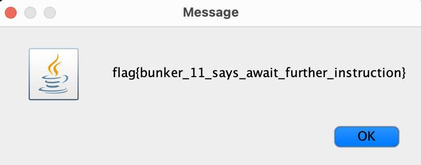

# bunker (rev, 100 points)

> You reach a large metal door. It's protected by large yellow bars. There appears to be an panel with a keypad...

## Files:

- Bunker.jar

```
❯ file Bunker.jar
Bunker.jar: Java archive data (JAR)
```

## Solution:

We'll decompile the file with vineflower:

```java
❯ vineflower Bunker.jar
...
==== Bunker.java ====
import java.awt.event.ActionEvent;
import java.awt.event.ActionListener;
import javax.swing.JButton;
import javax.swing.JFrame;
import javax.swing.JOptionPane;
import javax.swing.JPanel;
import javax.swing.JTextField;
import javax.swing.UIManager;

class Bunker extends JFrame implements ActionListener {
   static JFrame f;
   static JTextField l;
   String output = "";

   public static void main(String[] var0) {
      f = new JFrame("Bunker");

      try {
         UIManager.setLookAndFeel(UIManager.getSystemLookAndFeelClassName());
      } catch (Exception var13) {
         System.err.println(var13.getMessage());
      }

      Bunker var1 = new Bunker();
      l = new JTextField(8);
      l.setEditable(false);
      JButton var2 = new JButton("0");
      JButton var3 = new JButton("1");
      JButton var4 = new JButton("2");
      JButton var5 = new JButton("3");
      JButton var6 = new JButton("4");
      JButton var7 = new JButton("5");
      JButton var8 = new JButton("6");
      JButton var9 = new JButton("7");
      JButton var10 = new JButton("8");
      JButton var11 = new JButton("9");
      JPanel var12 = new JPanel();
      var2.addActionListener(var1);
      var3.addActionListener(var1);
      var4.addActionListener(var1);
      var5.addActionListener(var1);
      var6.addActionListener(var1);
      var7.addActionListener(var1);
      var8.addActionListener(var1);
      var9.addActionListener(var1);
      var10.addActionListener(var1);
      var11.addActionListener(var1);
      var12.add(l);
      var12.add(var2);
      var12.add(var3);
      var12.add(var4);
      var12.add(var5);
      var12.add(var6);
      var12.add(var7);
      var12.add(var8);
      var12.add(var9);
      var12.add(var10);
      var12.add(var11);
      f.add(var12);
      f.setSize(120, 500);
      f.show();
   }

   @Override
   public void actionPerformed(ActionEvent var1) {
      String var2 = var1.getActionCommand();
      this.output = this.output + var2;
      l.setText(this.output);
      if (this.output.length() == 8) {
         System.err.print("USER ENTERED: ");
         System.err.println(this.output);
         l.setText("");
         if (!this.output.equals("72945810")) {
            JOptionPane.showMessageDialog(null, "=== BUNKER CODE INVALID ===");
         } else {
            String var3 = "Q^XSNZD^\\WKk\u0004\tnCVKJkTOPYCm_AGLYUEmPZFLCETFP[[E";
            StringBuilder var4 = new StringBuilder();

            for(int var5 = 0; var5 < var3.length(); ++var5) {
               var4.append((char)(var3.charAt(var5) ^ this.output.charAt(var5 % this.output.length())));
            }

            String var6 = var4.toString();
            JOptionPane.showMessageDialog(null, var6);
         }

         this.output = "";
      }
   }
}
```

Now, we have the code that we need to enter. For the CTF, I just entered the code in by running the jar:

```
❯ java -jar Bunker.jar
```



