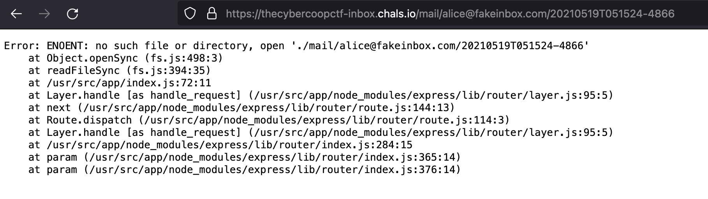

# inbox (web, 250 points)

> I heard this email server has two halves of a whole flag in it!

## Files:

- https://thecybercoopctf-inbox.chals.io/

## Solution:

Let's take a look at the site:

Following the link gives us a search interface:

Hmm... a search query. Let's search for `' UNION SELECT NULL, NULL ; --`...

We have SQL injection! Now time to have some fun...

(I got tired of typing uppercase SQL keywords, so... we get the less angry version now)

`' union select name, sql from sqlite_schema where type = 'table' ; --`

`' union select flag, null from flags ; --`

Off to a good start indeed. Let's poke around a little more... in places we probably have a little more permission to access.

Clicking on Alice's email address shows their emails. Let's click on one: `https://thecybercoopctf-inbox.chals.io/mail/alice@fakeinbox.com/20210519T051524-4865`:

Okay, nothing super useful here. What if we mess with the URL and make it invalid? Let's change `...4865` to `...4866`:

Interesting... it can't find the file. This could be a directory traversal attack, where we can put in whatever we want. After trying a few URLs, we find `https://thecybercoopctf-inbox.chals.io/mail/%2e%2e`:

which helps us narrow down the file structure more. Finally, we can read a file by going into Alice's mail again (sorry Alice D:) and get the flag: `https://thecybercoopctf-inbox.chals.io/mail/alice@fakeinbox.com/..%2f..%2fflag.txt`:

